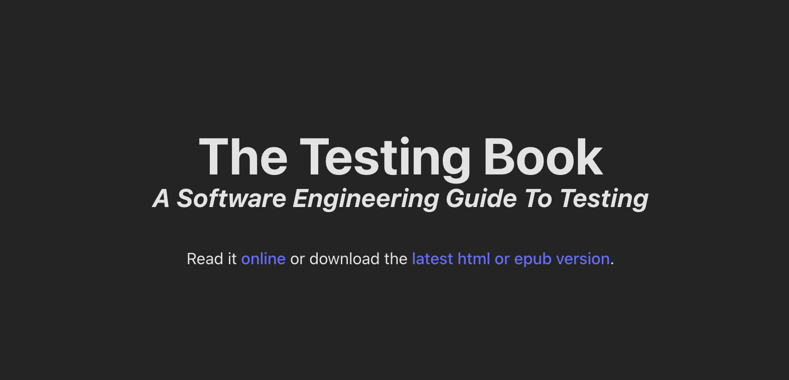
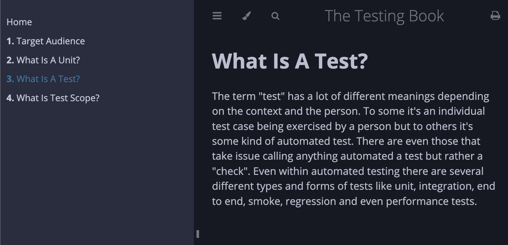

# The Testing Book

A Software Engineering Guide To Testing

Read it [online](https://testingrequired.github.io/the-testing-book/) or download the latest [html/epub versions](https://github.com/testingrequired/the-testing-book/actions/workflows/publish.yml#partial-actions-workflow-runs).

---

