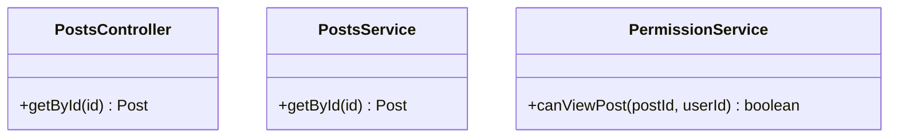
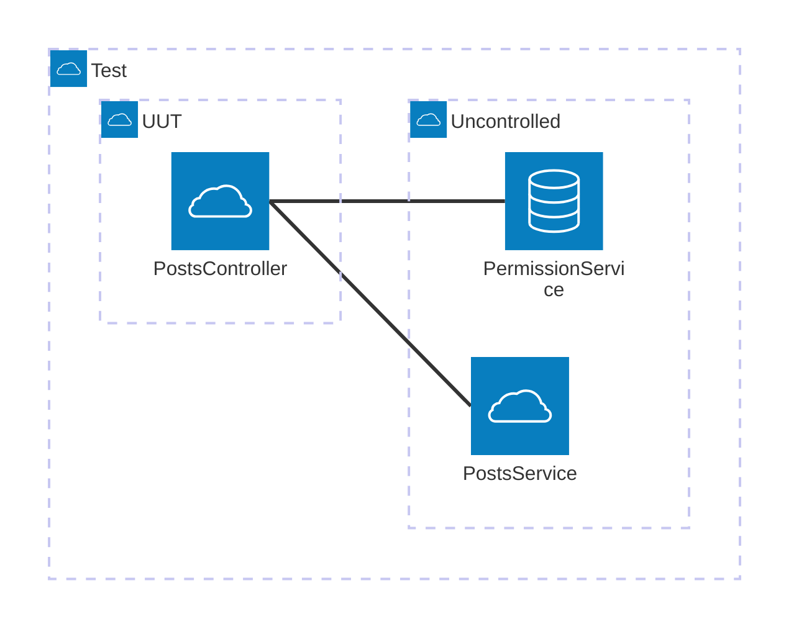

# What Is Test Scope?

Now that we've established what a test and unit is, let's talk about test scope. This book defines test scope as what units are included in the test's box and if they are controlled or not.

## Uncontrolled/Controlled Units

A controlled unit is a unit whose implementation is not ran or atleast partially not ran. An uncontrolled unit is a unit whose implementation is fully allowed to run. In other frameworks/libraries this is referred to as stubbing, faking or mocking.

## Example

### Units

### Uncontrolled

### Controlled

## The Cost Of Scope

- More scope catches more bugs but makes coverage harder to obtain
- Less scope identifies where the bug is occurring
