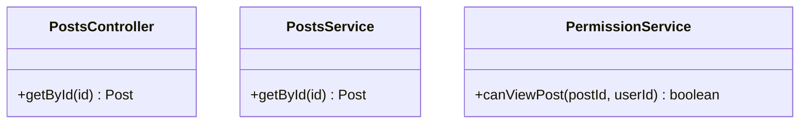
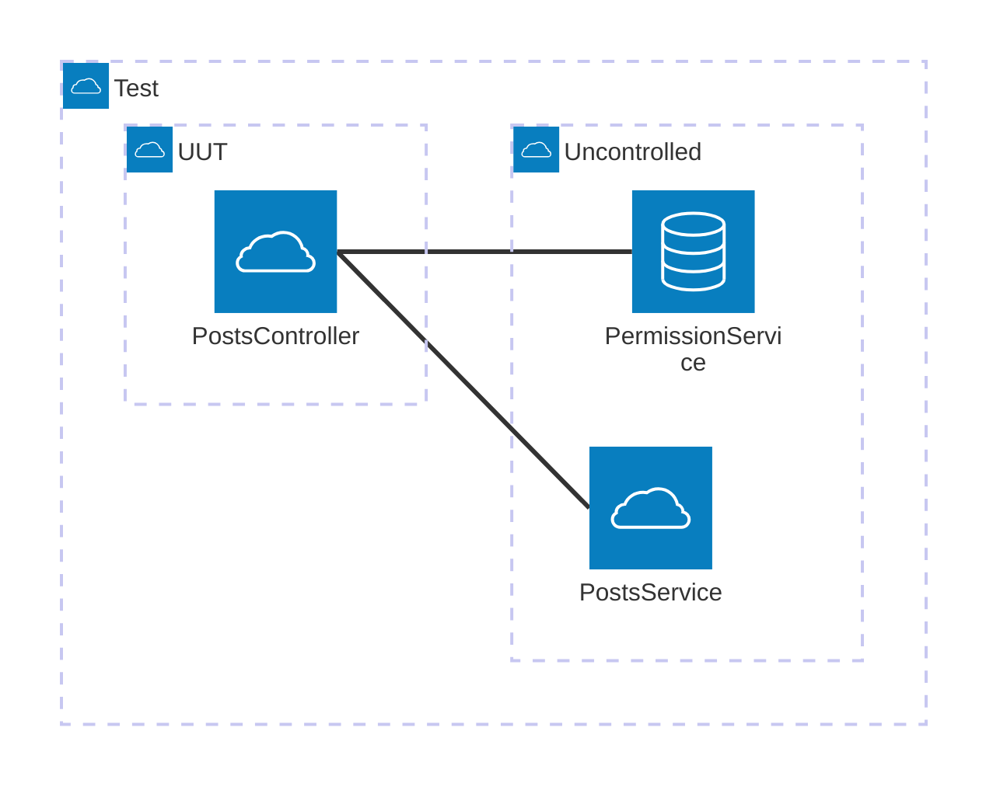

# What Is Test Scope?

Now that we've established what a test is, let's talk about test scope or rather go over some terminology first.

## Terminology

### Unit

This term is pretty loaded but in this book the term "unit" will refer to a single coheasive public function/method/object/interface. A class with multiple private methods and a single public method is a single unit. A public function that calls a bunch of private functions are collectively a single unit.

### Unit Under Test

In a test there is a single "unit under test" (<abbr>UUT</abbr>) which is the target for the test.

## Test Scope

This book defines test scope as what units are included in the test's box and if they are controlled or not.

## Example

### Units

### Uncontrolled

### Controlled

